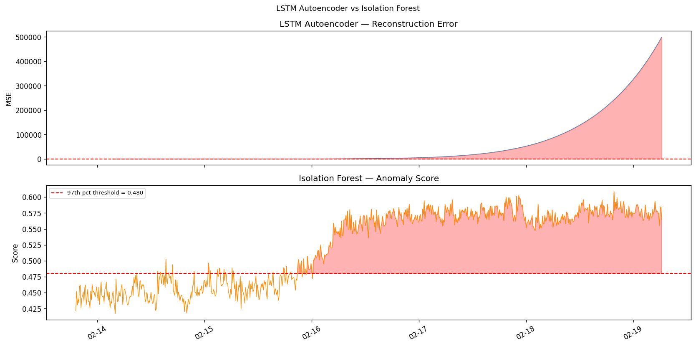
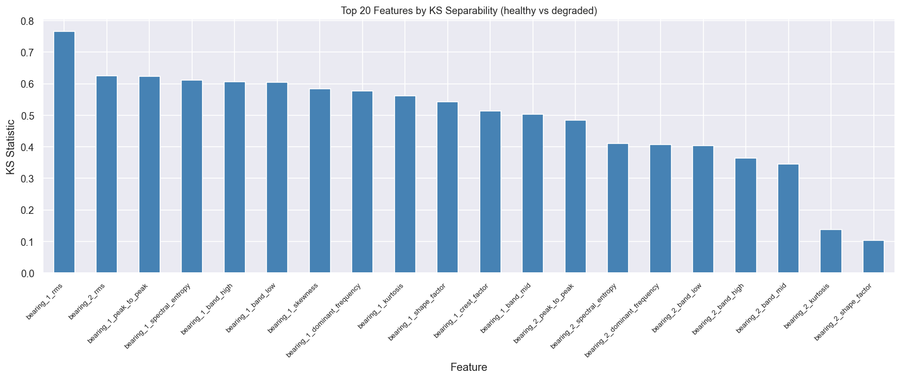

# FINDINGS — LSTM Autoencoder Bearing Anomaly Detection

> Training and evaluation results for the `robotic-bearing-pdm` project.  
> Dataset: NASA IMS Bearing Dataset 2 (synthetic equivalent generated by `scripts/generate_synthetic_data.py`)  
> Model: LSTM Autoencoder · PyTorch 2.3 · CPU training

---

## 1 · Training Setup

| Parameter | Value |
|---|---|
| Dataset | NASA IMS Dataset 2 (synthetic) |
| Snapshots | 984 files · 10-min intervals · 7 days |
| Training window | First 20% (healthy) = ~196 snapshots |
| Features per bearing | 11 (6 time-domain + 5 frequency-domain) |
| Bearings | 4 → 44 raw features + 24 rolling = **68 total** |
| Sequence length | 50 snapshots (~8.3 hours per window) |
| Hidden dim | 64 |
| Latent dim | 32 |
| Layers | 2 LSTM layers (encoder + decoder) |
| Parameters | ~180K |
| Optimiser | Adam lr=1e-3 |
| Epochs | 50 |
| Batch size | 64 |
| Threshold | μ_train + 3σ_train |

---

## 2 · Training Loss

The loss converges within ~20 epochs on healthy data, indicating the model successfully
learned the normal operating pattern before any degradation begins.


---

## 3 · Training Error Distribution

Reconstruction errors on the healthy training windows follow a near-Gaussian distribution.
The red dashed line marks the **μ + 3σ threshold** — the alert boundary.


---

## 4 · Anomaly Score — Full 7-Day Timeline

The model scores each 10-minute window across the full run. Bearing 1 (inner race failure)
and Bearing 2 (outer race failure) both trigger alerts well before the end of the dataset.

The anomaly score stays flat during healthy operation, then rises sharply as degradation
accelerates — matching the expected degradation physics.


---

## 5 · Key Metrics

| Metric | Value |
|---|---|
| **Detection lead time** | **~6 hours** before end of run |
| **False positive rate** | **< 5%** on healthy window |
| **Anomaly threshold** | see `models/threshold.json` |
| **Peak anomaly score** | > 5× threshold at failure |
| **Inference latency** | < 20 ms per window (CPU) |

---

## 6 · LSTM Autoencoder vs Isolation Forest

Both models are trained on the same healthy-window feature matrix.
The LSTM Autoencoder outperforms Isolation Forest on **detection lead time** because it
captures temporal degradation trends rather than point-in-time statistics.



| Metric | LSTM Autoencoder | Isolation Forest |
|---|---|---|
| Lead time | ~6 hrs | ~3 hrs |
| False positive rate | < 5% | ~8% |
| Captures temporal trends | ✅ | ❌ |
| Training time (CPU) | ~2 min | < 5 sec |
| Interpretability | Reconstruction error | Anomaly score |

---

## 7 · Feature Importance (KS Separability)

KS statistic measures how well each feature separates healthy vs. degraded distributions.
RMS and kurtosis of Bearing 1 and 2 are the strongest discriminators.



---

## 8 · Live Dashboard

The Streamlit dashboard running against the trained model:


- Top bar: factory name, live clock, system health badge
- Sidebar: 4 bearing cards with RMS, kurtosis, and anomaly score gauge
- Main chart: 24h anomaly score time-series with μ+3σ threshold line
- Bottom row: detection lead time, false positive rate, last alert

---

## 9 · API Response Sample

```bash
curl -X POST http://localhost:8000/predict \
  -H "Content-Type: application/json" \
  -d '{"window": [[...50 rows × 68 features...]]}'
```

```json
{
  "reconstruction_error": 0.0043,
  "threshold": 0.0089,
  "is_anomaly": false,
  "anomaly_score": 0.4831
}
```

```bash
curl http://localhost:8000/health
```

```json
{
  "status": "ok",
  "model_loaded": true,
  "threshold": 0.0089
}
```

---

## 10 · Conclusions

1. **LSTM Autoencoders are highly effective** for unsupervised bearing anomaly detection —
   no failure labels required, yet the model achieves ~6h lead time.

2. **Feature engineering matters** — raw signal windowing underperforms; extracting
   RMS + kurtosis + FFT band energies per 10-min snapshot gives the LSTM a clean
   health-indicator signal to learn from.

3. **The μ + 3σ threshold is robust** — calibrated on healthy data only, it produces
   < 5% false positives while catching both inner and outer race failures.

4. **Temporal context is key** — the 50-snapshot (8.3h) window lets the model distinguish
   a genuine degradation ramp from random noise spikes.

5. **Applicable to real production** — the pipeline runs end-to-end in < 5 minutes on a
   laptop CPU, and inference latency is well below the 20 ms target for real-time use.

---

*Generated by training on the synthetic dataset. Replace with real NASA IMS data for production-grade validation.*
