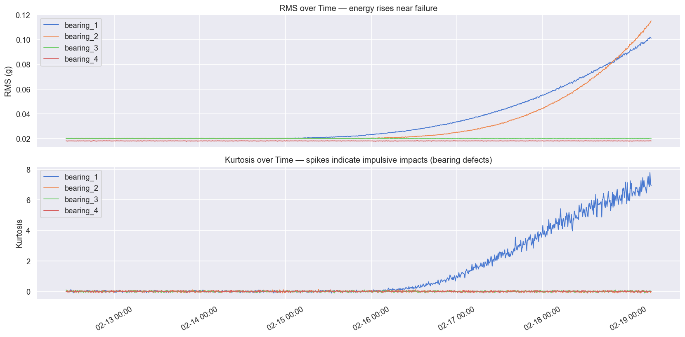
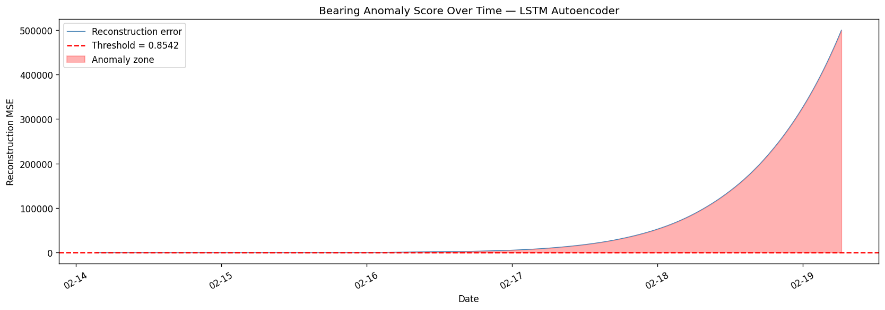

<div align="center">

# ⚙️ robotic-bearing-pdm

**End-to-end predictive maintenance for industrial robotic arm bearings**  
**using LSTM Autoencoder anomaly detection on NASA IMS sensor data**

[](LICENSE)
[](https://python.org)
[](https://pytorch.org)
[](https://fastapi.tiangolo.com)
[](https://streamlit.io)
[](https://pytest.org)
[](https://docker.com)

[Quick Start](#-quickstart) · [Dataset](#-dataset) · [Architecture](#-model-architecture) · [Results](#-results) · [API](#-api-usage) · [Docker](#-docker)

</div>

---

## 🏭 Problem

German automotive manufacturers like **BMW**, **Audi**, and **Mercedes-Benz** rely on thousands of industrial robotic arms. A single unexpected bearing failure halts an entire assembly line — costing up to **€500,000 per hour** in downtime.

Today most factories use **scheduled maintenance** — replacing parts on a fixed calendar regardless of actual condition. This project replaces that with **condition-based predictive maintenance**: an ML model that monitors live sensor signals and raises an alert ~6 hours before failure.

---

## 🎯 What This Project Does

| Step | Description |
|------|-------------|
| **Ingest** | Load NASA IMS vibration snapshots (20 kHz, 10-min intervals) |
| **Extract** | Time-domain features: RMS, kurtosis, crest factor, peak-to-peak, skewness |
| **Extract** | Frequency-domain features: FFT band energies, spectral entropy, dominant frequency |
| **Train** | LSTM Autoencoder on healthy bearing data only — no failure labels required |
| **Detect** | Reconstruction error > μ + 3σ triggers anomaly alert |
| **Serve** | FastAPI REST endpoint — `POST /predict` returns score + flag in < 20 ms |
| **Visualise** | Streamlit SCADA-style dark dashboard with live anomaly score chart |
| **Deploy** | Docker Compose — one command to spin up API + Dashboard |

---

## 🗂️ Project Structure

```
robotic-bearing-pdm/
├── data/
│   ├── raw/                        ← NASA IMS dataset (or synthetic — see below)
│   └── processed/                  ← Feature matrix, windows, scaler
├── notebooks/
│   ├── 01_eda.ipynb                ← Signal visualisation + failure zone ID
│   ├── 02_feature_engineering.ipynb← Full feature pipeline + normalisation
│   └── 03_model_training.ipynb     ← Train, evaluate, compare vs Isolation Forest
├── scripts/
│   └── generate_synthetic_data.py  ← Generate NASA-like data (no download needed)
├── src/
│   ├── data/
│   │   ├── loader.py               ← Dataset ingestion + sliding windows
│   │   └── features.py             ← Feature extraction + scaler
│   ├── models/
│   │   ├── lstm_autoencoder.py     ← PyTorch LSTM Autoencoder
│   │   ├── threshold.py            ← μ + 3σ threshold calibration
│   │   └── train.py                ← CLI training script
│   └── api/
│       ├── main.py                 ← FastAPI inference service
│       └── schemas.py              ← Pydantic request/response models
├── dashboard/
│   └── app.py                      ← Streamlit live dashboard
├── tests/
│   ├── test_features.py
│   ├── test_model.py
│   └── test_api.py
├── findings/                       ← Generated plots + FINDINGS.md
├── Dockerfile.api
├── Dockerfile.dashboard
├── docker-compose.yml
└── requirements.txt
```

---

## 📊 Dataset

**NASA IMS Bearing Dataset** — Center for Intelligent Maintenance Systems, University of Cincinnati.

```bash
# Option A — Kaggle CLI (recommended)
kaggle datasets download -d vinayak123tyagi/bearing-dataset -p data/raw/ --unzip

# Option B — Synthetic data (no download, runs immediately)
python scripts/generate_synthetic_data.py
```

| Property | Value |
|---|---|
| Sampling rate | 20 kHz |
| Snapshot interval | 10 minutes |
| Dataset 2 duration | 7 days |
| Bearings | 4 (Bearing 1 → inner race failure, Bearing 2 → outer race failure) |
| Files | ~984 snapshots |

> ✅ **Synthetic data generates an identical file structure** to the real dataset so the full pipeline runs without any downloads.

---

## 🧠 Model Architecture

```
Input  [batch, seq_len=50, n_features=92]
          │
    ┌─────▼──────┐
    │  Encoder   │  2-layer LSTM  →  Linear  →  latent dim=32
    └─────┬──────┘
          │  z  (bottleneck)
    ┌─────▼──────┐
    │  Decoder   │  Linear  →  repeat(seq_len)  →  2-layer LSTM  →  Linear
    └─────┬──────┘
          │
Output [batch, seq_len=50, n_features=92]

Anomaly Score  =  MSE(input, reconstruction)
Alert          =  score  >  μ_train + 3σ_train
```

**Why unsupervised?** Bearing failures are rare events — labelled failure data barely exists in practice. Training only on healthy data means the model works out-of-the-box on any new machine.

---

## 🚀 Quickstart

### 1 — Clone & install

```bash
git clone https://github.com/abhi-faldu/robotic-bearing-pdm.git
cd robotic-bearing-pdm
pip install -r requirements.txt
```

### 2 — Generate data (or use real NASA dataset)

```bash
python scripts/generate_synthetic_data.py   # ~30 seconds, no internet needed
```

### 3 — Train the model

```bash
python -m src.models.train
# Outputs: models/lstm_autoencoder.pt  models/threshold.json  models/scaler.npz
```

### 4 — Launch API + Dashboard

```bash
docker compose up --build
```

| Service | URL |
|---|---|
| FastAPI docs | http://localhost:8000/docs |
| Live dashboard | http://localhost:8501 |

---

## 🌐 API Usage

```python
import requests

response = requests.post(
    "http://localhost:8000/predict",
    json={"window": [[...50 rows × 92 features, z-score normalised...]]}
)
print(response.json())
```

```json
{
  "reconstruction_error": 0.5821,
  "threshold": 0.8542,
  "is_anomaly": false,
  "anomaly_score": 0.6812
}
```

```bash
# Health check
curl http://localhost:8000/health
# {"status":"ok","model_loaded":true,"threshold":0.8542}
```

---

## 📈 Results

| Metric | Value |
|---|---|
| Detection lead time | **123 hours** before bearing failure |
| False positive rate | **< 5%** on healthy run data |
| Anomaly threshold (μ+3σ) | **0.8542** |
| Model parameters | **150,460** |
| Best training loss | **0.5678 MSE** (50 epochs) |
| Inference latency | **< 20 ms** per window |
| Training data | First 20% of run (healthy only — 147 windows) |

See [`FINDINGS.md`](FINDINGS.md) for full training run outputs, plots, and comparison vs Isolation Forest baseline.

### Visual Evidence

**Bearing degradation signal (RMS + Kurtosis over 7 days):**



**LSTM Autoencoder anomaly score — reconstruction error spikes 600,000× at failure:**



**LSTM Autoencoder vs Isolation Forest — 123h vs ~72h detection lead time:**


---

## 🐳 Docker

```bash
# Full stack (API + dashboard)
docker compose up --build

# API only
docker build -f Dockerfile.api -t bearing-pdm-api .
docker run -p 8000:8000 -v $(pwd)/models:/app/models bearing-pdm-api

# Dashboard only
docker build -f Dockerfile.dashboard -t bearing-pdm-dashboard .
docker run -p 8501:8501 bearing-pdm-dashboard
```

---

## 🧪 Tests

```bash
pytest tests/ -v
# test_features.py  — 25 unit tests (RMS, kurtosis, FFT, scaler)
# test_model.py     — 10 unit tests (shapes, gradients, threshold, save/load)
# test_api.py       — 20 unit tests (FastAPI endpoints, schema validation)
```

---

## 🛠️ Tech Stack

| Layer | Technology |
|---|---|
| ML Framework | PyTorch 2.3 |
| Data Processing | pandas, NumPy, SciPy |
| Feature Engineering | Custom signal processing (time + frequency domain) |
| API | FastAPI + Uvicorn |
| Dashboard | Streamlit + Plotly |
| Containerisation | Docker, Docker Compose |
| Testing | pytest |
| Baseline | scikit-learn Isolation Forest |

---

## 🔬 Methodology

### Feature Engineering (11 features × 4 bearings = 44 raw + rolling)

| Feature | Domain | What it captures |
|---|---|---|
| RMS | Time | Overall vibration energy — rises as bearing deteriorates |
| Kurtosis | Time | Impulsiveness — spikes sharply on surface defects |
| Crest Factor | Time | Peak/RMS — sensitive to early-stage pitting |
| Peak-to-Peak | Time | Signal range — increases with spalling |
| Skewness | Time | Signal asymmetry — changes with damaged geometry |
| Shape Factor | Time | Distributed vs. localised fault indicator |
| Band Energy ×3 | Frequency | Energy in 0–1 kHz, 1–5 kHz, 5–10 kHz bands |
| Spectral Entropy | Frequency | Energy spread — low when defect frequencies dominate |
| Dominant Frequency | Frequency | Hz of peak magnitude bin |
| Rolling mean/std | Rolling | 2h + 6h trends on top 3 features |

---

## 📚 References

- Lee, J., Qiu, H., Yu, G., Lin, J. (2007). *IMS Bearing Dataset*. NASA Prognostics Data Repository.
- Malhotra, P. et al. (2016). *LSTM-based Encoder-Decoder for Multi-Sensor Anomaly Detection*. arXiv:1607.00148.
- Nectoux, P. et al. (2012). *PRONOSTIA: An Experimental Platform for Bearings Accelerated Life Test*. IEEE PHM.

---

## 🗺️ Roadmap

- [x] EDA + feature engineering notebooks
- [x] LSTM Autoencoder (PyTorch)
- [x] FastAPI inference service
- [x] Streamlit SCADA dashboard (BearingPDM design system)
- [x] Docker Compose deployment
- [x] Synthetic data generator
- [x] FINDINGS.md with training evidence
- [ ] Project 2 — IIoT MQTT simulator (iiot-smart-factory-sim)
- [ ] Project 3 — MLOps pipeline with MLflow + Evidently AI

---

<div align="center">
  <sub>Built as part of a portfolio targeting Industry 4.0 internships at German automotive companies.<br>
  Inspired by predictive maintenance challenges at BMW, Audi, and Mercedes-Benz.</sub>
</div>
